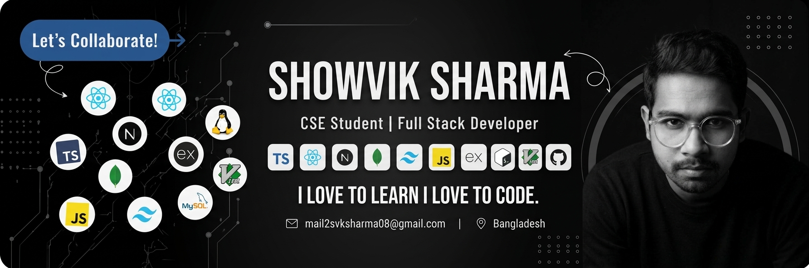

<p align="center">
  
</p>

<h1 align="center">Hi 👋, I'm Showvik Sharma</h1>

<h3 align="center">
  Full-Stack Web Developer | CSE Undergraduate | Linux, DevOps & Cybersecurity Enthusiast
</h3>

<p align="center">
  <a href="https://git.io/typing-svg">
    
  </a>
</p>

<p align="center">
  
  
  
</p>

<p align="center">
  <a href="https://github.com/svksharma">
    
  </a>
</p>

---

## 🚀 About Me

I'm a 3rd-year **Computer Science & Engineering** student from **Bangladesh** and a full-stack web developer who enjoys taking ideas from a blank file to a real, working product.

My programming journey started with curiosity about **space, robotics, and cybersecurity**. Over time, that curiosity turned into a habit of building practical software, exploring how systems work underneath the interface, and learning how applications run reliably in production.

<table>
  <tr>
    <td width="50%" valign="top">
      <h3>What I'm building</h3>
      <ul>
        <li>Full-stack <b>Hospital Management System</b></li>
        <li>Role-based dashboards for hospital workflows</li>
        <li>Backend logic with <b>Flask</b> and <b>MySQL</b></li>
        <li>Clean database design and practical user flows</li>
      </ul>
    </td>
    <td width="50%" valign="top">
      <h3>What I'm learning</h3>
      <ul>
        <li><b>React</b>, <b>Next.js</b>, and modern frontend patterns</li>
        <li>Backend engineering with <b>Python</b></li>
        <li>Linux-first development workflows</li>
        <li>DevOps, deployment, and cybersecurity fundamentals</li>
      </ul>
    </td>
  </tr>
</table>

<p align="center">
  
  
  
  
</p>

---

## 🧠 Current Focus

```text
🏥 Building a production-style Hospital Management System
⚛️ Sharpening React and Next.js for real-world frontend work
🐍 Improving backend architecture with Python, Flask and SQL
🐧 Customizing Linux workflows, window managers and developer tooling
🔐 Studying how software is deployed, secured and maintained
```

---

## 🛠️ Tech Stack

<div align="center">

### Languages

<a href="https://skillicons.dev">
  
</a>

### Frontend

<a href="https://skillicons.dev">
  
</a>

### Backend

<a href="https://skillicons.dev">
  
</a>

### Databases

<a href="https://skillicons.dev">
  
</a>

### Tools, Linux & DevOps

<a href="https://skillicons.dev">
  
</a>

</div>

---

## 🏗️ Featured Work

<table>
  <tr>
    <td width="50%" valign="top">
      <h3>🏥 Hospital Management System</h3>
      <p>
        A full-stack hospital management platform focused on role-based access, organized dashboards, and practical database-backed workflows for hospital operations.
      </p>
      <p>
        
        
        
      </p>
    </td>
    <td width="50%" valign="top">
      <h3>🐧 Linux & Developer Workflow</h3>
      <p>
        Custom Linux setups, window manager configuration, terminal-first workflows, and a growing interest in how developer environments can be made faster and cleaner.
      </p>
      <p>
        
        
        
      </p>
    </td>
  </tr>
</table>

---

## 📊 GitHub Analytics

<p align="center">
  
  
</p>

<p align="center">
  
</p>

<p align="center">
  
</p>

---

## 🏆 GitHub Trophies

<p align="center">
  
</p>

---

## 🐍 Contribution Snake

<p align="center">
  <picture>
    <source media="(prefers-color-scheme: dark)" srcset="https://raw.githubusercontent.com/svksharma/svksharma/output/github-contribution-grid-snake-dark.svg" />
    <source media="(prefers-color-scheme: light)" srcset="https://raw.githubusercontent.com/svksharma/svksharma/output/github-contribution-grid-snake.svg" />
    
  </picture>
</p>

---

## 💬 Engineering Note

> "Perfection is achieved, not when there is nothing more to add, but when there is nothing left to take away."
> — Antoine de Saint-Exupéry

That idea matches how I try to build software: clear structure, useful features, readable code, and fewer unnecessary abstractions. Whether I am designing a database schema, writing backend logic, or refining a Linux setup, I like systems that are simple enough to understand and strong enough to grow.

---

<p align="center">
  <b>Thanks for visiting my profile.</b><br />
  Always learning, always building, and always open to meaningful collaboration.
</p>
